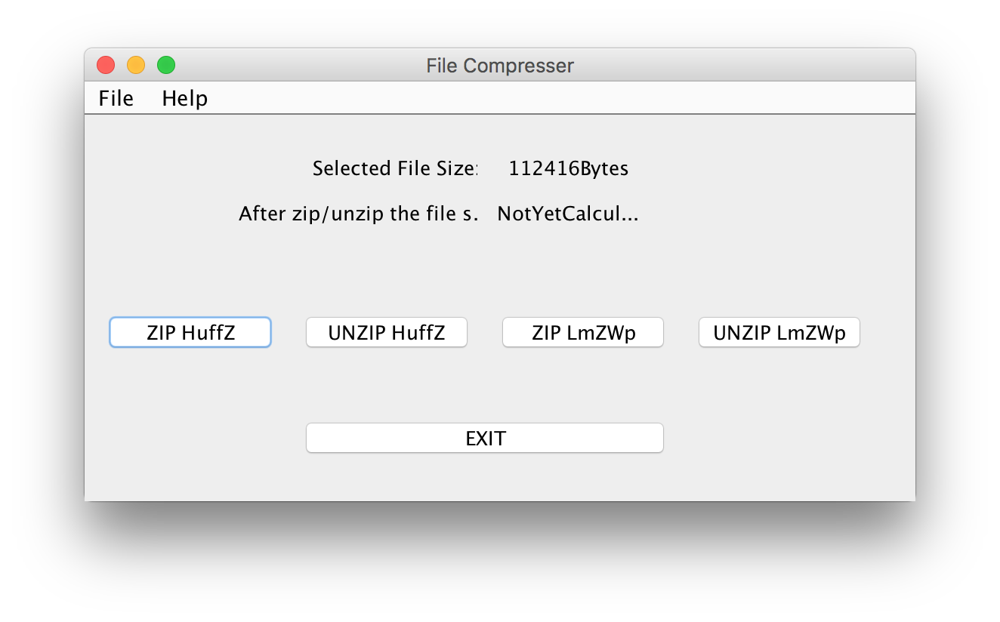

# Text-Compression

A Text Compression software that helps zip/Unzip files using these 2 algorihtms:

1. Huffman Code
2. Lempel-Ziv-Welch algorithm

## About Huffman Code

Huffman coding is a lossless data compression algorithm. In this algorithm, a variable-length code is assigned to input different characters. The code length is related to how frequently characters are used. Most frequent characters have the smallest codes and longer codes for least frequent characters.

## About Lempel-Ziv-Welch

LZW coding assigns fixed length code words to variable length sequence of input symbols. The coding is based on a “dictionary” or “codebook” containing the source symbols to be encoded. The coding starts with an initial dictionary, which is enlarged with the arrival of new symbol sequences.

## Running Instruction:

## Zip a file
file>open>click zip>the zipped file will be created on the same folder

## Unzip a file
file>open>click unzip>the unzipped file will be created on the same folder

